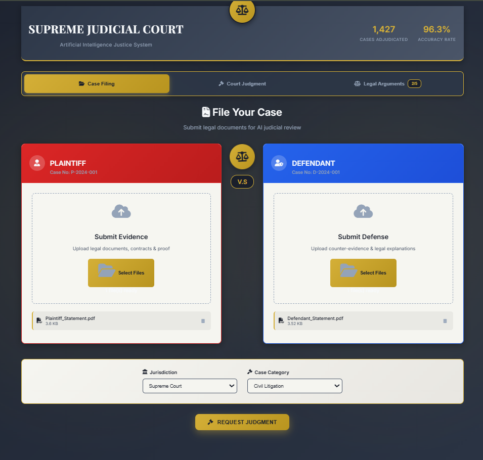

# ⚖️ AI Judge – Digital Courtroom System

An AI-powered legal adjudication platform that simulates courtroom case filing, evidence evaluation, judicial reasoning, and structured argument rounds using Google Gemini Flash via FastAPI.

This project demonstrates real-world application of AI for legal judgment automation, including document parsing, evidence extraction, verdict generation, and structured argument handling between plaintiff and defendant.

---

## 🚀 Features

### 📝 Case Filing

- Upload plaintiff & defendant documents (`PDF`, `DOCX`, `TXT`)
- Intelligent text extraction from legal files
- Automatic validation & preprocessing
- Court-style UI with animated scales & wood-panels

### ⚖️ AI-Generated Judgment

- Uses **Gemini Flash (latest)** for real-time inference
- Returns:
  - Verdict
  - Legal reasoning
  - Key evidences
  - Confidence score
- Dynamic date included in the judgment
- Supports re-evaluation after each argument

### 🗣️ Argument Rounds (5 rounds)

- Plaintiff arguments panel
- Defendant arguments panel
- Court timeline showing structured argument exchange
- Real-time verdict update after each argument

### 🧵 Persistent Case Memory

- Flutter-like state management (JS)
- Optional Redis caching (if available)
- Case ID created on document upload

### 🛡️ Fully Responsive UI

- Modern dark legal theme
- Animated gradients, scale balance animation
- Smooth transitions between:
  - Case Filing
  - Judgment
  - Arguments

---

## 🏗️ Project Architecture

```
frontend/
│── index.html
│── style.css
│── script.js

backend/
│── main.py (FastAPI backend)
│── utils/ (file extraction helpers)
│── .env (Gemini API key)
```

### 📌 Frontend

Built with pure **HTML + CSS + JavaScript**, following an advanced legal-themed interface.

### 📌 Backend

Built using **FastAPI**, features include:

- File upload endpoints
- Document text extraction
- Prompt construction engine
- Gemini Flash API caller
- Verdict generator
- Argument handler
- Optional Redis caching

---

## 🧠 AI Model

### Model Used

**Google Gemini – Flash (Latest)**

Chosen because:

- Extremely fast
- High-quality legal reasoning
- Stable JSON support
- Ideal for step-based argument reasoning

### Strict JSON Enforcement

Responses enforced via:

```json
{
  "verdict": "",
  "reasoning": "",
  "confidence": "",
  "key_evidence": {
    "plaintiff": [],
    "defendant": []
  }
}
```

---

## 🔌 API Endpoints

### 1. Upload Documents

**POST** `/api/upload-documents`

Uploads documents and extracts text.

### 2. Get Verdict

**POST** `/api/get-verdict`

Generates judgment using Gemini.

### 3. Submit Argument

**POST** `/api/submit-argument`

Submits plaintiff/defendant arguments and gets updated verdict.

### 4. Case Status (optional)

**GET** `/api/case-status/{case_id}`

---

## 🛠️ Installation & Setup

### 1️⃣ Clone the Repository

```bash
git clone https://github.com/YOUR_USERNAME/ai-judge.git
cd ai-judge
```

### 2️⃣ Backend Setup

Install requirements:

```bash
pip install -r requirements.txt
```

Create `.env`:

```env
GEMINI_API_KEY=YOUR_KEY_HERE
```

Run FastAPI server:

```bash
uvicorn main:app --reload
```

### 3️⃣ Frontend Setup

Just open:

```bash
index.html
```

in any browser.

---

## 🧪 Example Use-Case

1. Upload Plaintiff and Defendant legal PDFs
2. AI evaluates uploaded evidence
3. Verdict generated:
   - Guilty / Not Guilty / Decision
4. Move to Arguments Phase
5. Submit arguments from both sides
6. AI updates judgment after every round
7. Final legal decision rendered

---

## 📸 Screenshots

### Case Filing Page



### Judgment Page


### Arguments Page


## 🔮 Future Enhancements

- Multi-case dashboard
- Judge persona selection (strict, balanced, lenient)
- Multi-language legal processing (Hindi, Marathi, etc.)
- Full chain-of-thought reasoning (hidden by default)
- Audio-to-text legal submissions

---

## 👨‍💻 Author

**Sumit Jha**

- AI • Backend • C++ • Web Development

---

## 📜 License

MIT License — free to use, modify, and distribute.

## 🎬 Video

Video link (as provided in the assignment):

[Watch the Video](https://youtu.be/RuFlNjfUR9E)
